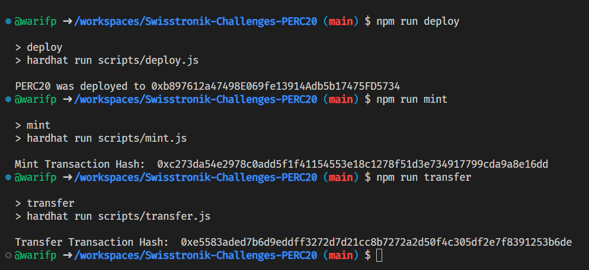

# Swisstronik Developers' Challenge PERC20

This project demonstrates a basic Hardhat use case. It comes with a sample contract, a test for that contract, and a script that deploys that contract.

## Task

Create a PERC20 token, deploy the contract to the Swisstronik network, mint and transfer 1 token to 0x16af037878a6cAce2Ea29d39A3757aC2F6F7aac1

## Setup

1. Copy .env.example to .env
2. Update file .env with add PRIVATE_KEY
3. Save

## Usage

```shell
npm run deploy
npm run mint
npm run transfer
```

## Deployed Contracts

```
Smart Contract : 0xb897612a47498E069fe13914Adb5b17475FD5734
EVM            : 0xfE46d95aE3d46d2ff11C246a38bcb4456621f9e6
```

## Deployed on Token

```
Token Name   : WARIFP
Token Symbol : WAP
```

## Transaction

### Mint Token

TX Mint

```
https://explorer-evm.testnet.swisstronik.com/tx/0xc273da54e2978c0add5f1f41154553e18c1278f51d3e734917799cda9a8e16dd
```

TX Transfer
Token Transfer "1" to Address ```0x16af037878a6cAce2Ea29d39A3757aC2F6F7aac1```

```
https://explorer-evm.testnet.swisstronik.com/tx/0xe5583aded7b6d9eddff3272d7d21cc8b7272a2d50f4c305df2e7f8391253b6de
```

## Image Proof


